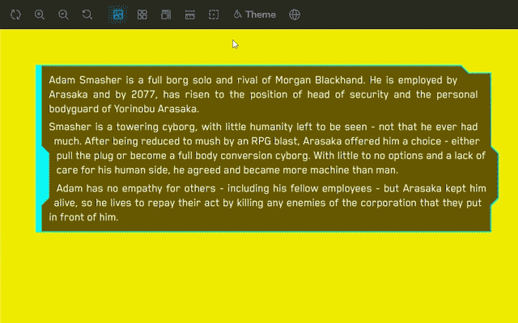

# Storybook Addon Multiselect

Toolbar addon for Storybook that allows to create dropdown(s) to select single or multiple options. Also, there's user defined type of options - that allows user to toggle between select single/multiple option(s).

`onChange` callback returns an array of selected options with exposing Storybook API. This callback allows to manipulate with both selected options and Storybook API.

To access selected options in your stories, you need to implement your own decorator component that will access `globals.multiselect` and you can use it in your stories.

Optional Reset to default button that resets all options to default values.



## Live demo

https://cyberpunk-ui-library.vercel.app \
[Source code](https://github.com/somewonderfulguy/cyberpunk/tree/master/packages/library)

Here in the top bar you can see the addon in action. There are two dropdowns 'Theme Storybook' and 'Theme & Language'. Both of them are implemented with this addon.

'Theme Storybook' is a single select dropdown that allows to change Storybook theme (outer shell) - for this `onChange` callback used as it allows to reach Storybook API.

'Theme & Language' is a complex dropdown that has single and multiple select groups, as well as reset button.

## Quick start

Here's a quick and minimal example of how to use this addon:

```sh
npm i -D storybook-addon-multiselect
```

```ts
// .storybook/main.ts

const config: StorybookConfig = {
  // ... (other config)
  addons: [
    // ... (other addons)
    'storybook-addon-multiselect'
  ]
  // ... (other config)
}
```

```ts
// .storybook/preview.ts(x)

// ... (other imports)
import { Addon } from 'storybook-addon-multiselect'
import ExampleDecorator from '../src/ExampleDecorator'

const multiselect: Addon = {
  example: {
    icon: <>💾</>,
    elements: [
      {
        type: 'singleSelect',
        queryKey: 'example',
        options: [
          { title: 'Option 1', value: 'option1' },
          { title: 'Option 2', value: 'option2' },
          { title: 'Option 3', value: 'option3' }
        ]
      }
    ]
  }
}

const preview: Preview = {
  parameters: {
    // ... (other parameters)
    multiselect
  },
  decorators: [
    // ... (other decorators)
    ExampleDecorator
  ]
}
```

```ts
// src/ExampleDecorator.tsx

import type { Decorator } from '@storybook/react'

const ExampleDecorator: Decorator = (Story, context) => {
  const { globals } = context
  const multiselect: { [key: string]: string | string[] } = globals.multiselect
  const example = multiselect.example as 'option1' | 'option2' | 'option3'
  console.log('example value', example)

  return <Story />
}

export default ExampleDecorator
```

## Detailed usage

_Section is in progress_

`npm i -D storybook-addon-multiselect`

Add addon in `.storybook/main.ts`:

```ts
const config: StorybookConfig = {
  // ...
  addons: [
    // ...
    'storybook-addon-multiselect'
  ]
  // ....
}
```

Set up options in `.storybook/preview.tsx`:

```ts
// Addon is heavily typed and have jsdoc comments, so you can see all the clues in your IDE
import { Addon } from 'storybook-addon-multiselect'

// implement your own decorator component that will access `globals.multiselect` and you can use it in your stories
import YourDecoratorComponent from '../src/decorators/YourDecoratorComponent'

const multiselect: Addon = {
  // how many keys is how many dropdowns will be rendered
  theme: {
    // (optional)
    name: 'Theme',
    // put your svg or emoji (optional)
    icon: <svg />,
    // (optional)
    description: 'Change theme of Storybook (outer shell)',
    elements: [
      // reset button (optional)
      { type: 'reset' },
      // single select
      {
        type: 'singleSelect',
        // key that will be used in query string (required)
        queryKey: 'priority',
        // title of dropdown (required)
        title: 'Priority',
        // default value (optional)
        defaultValue: 'theme',
        // options (required)
        options: [
          {
            // title of option (required)
            title: 'Theme',
            // value of option (required)
            value: 'theme',
            // left side of option (optional)
            left: <svg />
          },
          {
            title: 'Language',
            value: 'lang',
            left: <svg />
          }
        ]
      }
    ]
  },
  themeAndLanguage: {
    // ...
  }
}

const preview: Preview = {
  // ...
  parameters: {
    // ...
    multiselect
  },
  decorators: [
    // ...
    YourDecoratorComponent
  ]
}
```

## Things to do

- Add boolean flag to close toolbar after selection
- Measure performance and optimize

## Known issues

_Section is in progress_
